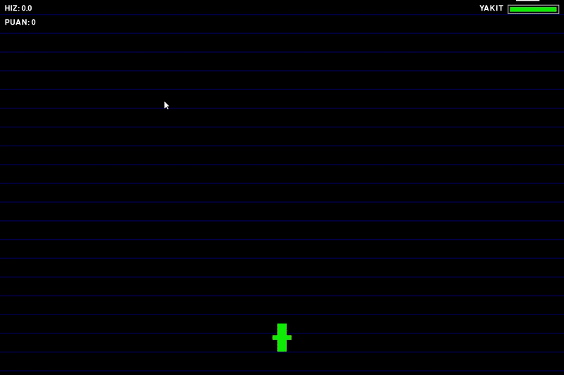

Retro Uçak Simülasyonu
Pygame ile geliştirilmiş, klasik atari oyunlarından ilham alan dinamik ve özellik dolu bir 2D uçak simülasyonu. Gökyüzünde süzülün, engellerden kaçın, güçlendirmeleri toplayın ve en yüksek puanı hedefleyin!

🎮 Oynanış Videosu (GIF)

✨ Gelişmiş Özellikler
Bu simülasyon, basit bir uçuş oyunundan çok daha fazlasını sunar. İşte oyunu benzersiz kılan bazı özellikler:

🚀 Dinamik Hız ve Yakıt Yönetimi
Oyun sadece yatay hareketten ibaret değil. Hızınızı artırarak arka planın daha hızlı akmasını sağlayabilir veya yavaşlayarak daha dikkatli manevralar yapabilirsiniz. Ama dikkat! Hızlandıkça yakıtınız daha çabuk tükenir. Yakıtınız biterse, oyun da biter!

☁️ Engeller ve Stratejik Çatışma
Gökyüzü tehlikelerle dolu! Karşınıza çıkan bulutlara çarpmak yakıtınızı azaltır ve puan kaybettirir. Onları yok etmek için ateş edebilir veya etraflarından dolaşarak stratejik bir avantaj elde edebilirsiniz. Vurduğunuz her bulut, size değerli güçlendirmeler düşürme şansına sahiptir.

🎁 Güçlendirmeler ve Özel Yetenekler
Vurulan bulutlardan veya rastgele olarak ortaya çıkan özel item'ları toplayarak oyunda üstünlük kurun.

🔥 Süper Jet
Bu güçlendirmeyi aldığınızda kısa süreliğine maksimum hıza ulaşırsınız ve bulutlara çarpsanız bile hasar almazsınız. Önünüze çıkan her şeyi yok etmek için mükemmel bir fırsat!

✌️ Ekstra Uçak (2X Uçuş)
Yanınıza size destek olacak ikinci bir uçak alın! Bu yardımcı uçak, sizinle birlikte hareket eder ve ateş ederek ateş gücünüzü ikiye katlar. Sınırlı bir süre için geçerlidir, bu yüzden iyi değerlendirin!

💣 Mayın Temizliği
Ekrandaki tüm bulutlardan tek seferde kurtulmak mı istiyorsunuz? "MINE" item'ı tam size göre. Bu güçlendirme, ekrandaki tüm bulutları anında yok eder ve size toplu puan kazandırır.

🌈 Renk Değişimi
Kısa bir süreliğine uçağınızın rengarenk bir şekilde yanıp sönmesini sağlayan eğlenceli bir kozmetik güçlendirme. Gökyüzünde tarzınızı konuşturun!

⛽ Yakıt İkmali
Uçuşa devam etmenin anahtarı! Bu sarı kutuları toplayarak azalan yakıt deponuzu doldurun ve oyunda daha uzun süre kalın.

🕹️ Kontroller
Tuş

Eylem

↑ YUKARI OK

Hızı Artır

↓ AŞAĞI OK

Hızı Azalt

← SOL OK

Sola Hareket Et

→ SAĞ OK

Sağa Hareket Et

BOŞLUK

Ateş Et

R

(Oyun Bitince) Yeniden Başlat

ESC

Oyundan Çık

🛠️ Kurulum ve Çalıştırma
Bu oyunu kendi bilgisayarınızda çalıştırmak için aşağıdaki adımları izleyin:

Python'un kurulu olduğundan emin olun.
Değilse, python.org adresinden indirebilirsiniz.

Pygame kütüphanesini yükleyin.
Terminal veya komut istemcisine aşağıdaki komutu yazın:

pip install pygame

Bu repoyu klonlayın veya dosyaları indirin.

git clone [REPO_URL]

Oyunu çalıştırın.
İndirdiğiniz klasörde terminali açın ve şu komutu girin:

python main.py 

(Not: Python dosyanızın adı farklıysa komutu ona göre güncelleyin.)

İyi uçuşlar!
